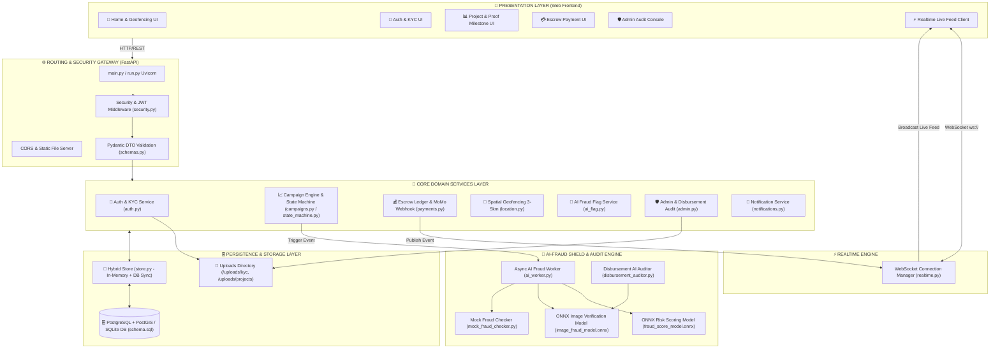

# 🏆 LocalVest — Nền Tảng Gọi Vốn Cộng Đồng Minh Bạch (MVP)

> **LocalVest** là nền tảng gọi vốn cộng đồng thế hệ mới, tiên phong giải quyết bài toán minh bạch tài chính trong các chiến dịch xã hội và khởi nghiệp địa phương bằng việc kết hợp **Ký quỹ dòng tiền theo mốc (Milestone-based Escrow)**, **Lá chắn cảnh báo gian lận AI (Async AI-Fraud Shield Engine)** và **Bản đồ định vị dự án theo bán kính tác động 3-5km (Spatial Geofencing & Dynamic Radius)**.

### 🌟 GIÁ TRỊ CỐT LÕI & ĐIỂM SÁNG CÔNG NGHỆ (KEY PILLARS)

- 🔒 **Minh Bạch Ký Quỹ Escrow (Milestone Disbursement)**: Toàn bộ vốn đóng góp của cộng đồng được bảo an tuyệt đối trong Sổ cái Ký quỹ (Escrow Ledger). Dòng tiền chỉ được giải ngân từng phần theo cột mốc (Milestone) sau khi được AI và Admin thẩm định bằng chứng nghiệm thu (Proof of Work).
- 🤖 **Lá Chắn An Toàn AI (AI-Fraud Shield & Disbursement Auditor)**: Tích hợp các mô hình học máy ONNX chạy bất đồng bộ để phân tích điểm rủi ro gian lận văn bản, nhận diện chỉ số tài chính bất thường và tự động soi chiếu tính trung thực của hình ảnh nghiệm thu.
- 📍 **Bản Đồ Định Vị Tác Động Cộng Đồng (Geofencing 3-5km Radius)**: Tận dụng thuật toán Haversine và chỉ mục không gian (PostGIS Spatial Index) cho phép Nhà đầu tư khám phá, kết nối và hỗ trợ các dự án phát triển ngay tại khu vực sinh sống của mình.
- ⚡ **Theo Dõi Dòng Tiền Thời Gian Thực (Realtime WebSocket Live Feed)**: Phát sóng tức thời (Realtime Broadcast) mọi biến động nạp vốn, biến động sổ cái và tiến độ giải ngân đến toàn bộ người dùng đang truy cập hệ thống.

---

## ⚠️ GHI CHÚ QUAN TRỌNG: VỀ CÁC ĐƯỜNG DẪN LINK VÀ TỆP KHỞI ĐỘNG

> [!WARNING]
> Nếu bấm vào link `http://127.0.0.1:8000/docs` hoặc `ws://127.0.0.1:8000/ws/live-feed` mà trình duyệt báo lỗi **"Không thể kết nối / Trang web không hoạt động"**:
> 
> **NGUYÊN NHÂN**: Do Server Python chưa được khởi động trong Terminal nên cổng `8000` chưa lắng nghe.
> 
> **CÁCH MỞ LINK THÀNH CÔNG**:
> 1. Mở Terminal tại thư mục `LocalVest` (thư mục gốc chứa file `run.py`) và gõ:
>    ```bash
>    python run.py
>    ```
> 2. Giữ nguyên cửa sổ Terminal đó đang chạy, hệ thống sẽ tự động mở trình duyệt web lên cho bạn. Lúc này các đường dẫn link sẽ truy cập được 100%!
---

## TỔNG QUAN KIẾN TRÚC HỆ THỐNG (SYSTEM DESIGN)

Hệ thống **LocalVest** được thiết kế theo kiến trúc **Modular Monolith Enterprise**, kết hợp giữa giao diện Web đa trang phản hồi nhanh, hệ thống RESTful API chuẩn hóa, cơ chế đẩy dữ liệu thời gian thực (Realtime WebSocket) và bộ máy trí tuệ nhân tạo kiểm tra gian lận bất đồng bộ (Async AI-Fraud Shield Engine).

### 🏗️ Sơ Đồ Tổng Quan Kiến Trúc (Architecture Diagram)



---

### 🧩 Chi Tiết Các Phân Lớp Kiến Trúc (Architecture Layers)

1. **Presentation Layer (Web Frontend Application)**:
   - Được xây dựng bằng HTML5, CSS3 và Vanilla JavaScript thuần (Fetch API, Async/Await), không phụ thuộc framework nặng, đảm bảo tốc độ tải cực nhanh.
   - Tích hợp Geolocation API & Bảng điều khiển bản đồ tương tác để lọc dự án theo bán kính 3-5km.
   - Kết nối WebSocket Client để nhận tin nhắn biến động dòng tiền và tiến độ giải ngân theo thời gian thực.

2. **Routing & Security Gateway Layer (FastAPI Entry Point)**:
   - `run.py` & `backend/main.py`: Điểm khởi chạy hệ thống, mount các thư mục tĩnh Frontend & Uploads.
   - **CORS & Static Middleware**: Phục vụ tài nguyên và cho phép gọi API an toàn.
   - **Security Middleware** (`core/security.py`): Mã hóa mật khẩu chuẩn Bcrypt, phát hành và xác thực JSON Web Token (JWT), kiểm soát phân quyền dựa trên vai trò (RBAC: Investor, Creator, Admin).
   - **Pydantic DTO Layer** (`schemas/schemas.py`): Kiểm tra và validate chặt chẽ kiểu dữ liệu đầu vào/đầu ra của 100% API endpoints.

3. **Core Domain Services Layer (Nghiệp Vụ Cốt Lõi)**:
   - **Auth & KYC Service** (`auth.py`): Quản lý đăng ký, đăng nhập và tải/thẩm định hồ sơ KYC (CCCD, selfie).
   - **Campaign Lifecycle Service** (`campaigns.py` & `campaign_state_machine.py`): Quản lý vòng đời dự án qua State Machine nghiêm ngặt (`draft` ➔ `pending_review` ➔ `active` ➔ `funded` / `expired` ➔ `completed`).
   - **Escrow & Ledger Service** (`payments.py`): Tiếp nhận Webhook thanh toán (MoMo/VNPay), duy trì Sổ cái Ký quỹ (Escrow Ledger) bất biến, đảm bảo tính minh bạch 100% dòng tiền.
   - **Geofencing & Spatial Service** (`location.py`): Tính toán khoảng cách địa lý giữa Nhà đầu tư và Dự án bằng thuật toán Haversine / Bounding Box spatial index trong bán kính 3-5km.
   - **Admin Moderation Service** (`admin.py`): Bảng điều khiển dành riêng cho Quản trị viên duyệt dự án, thẩm định minh chứng cột mốc và ra lệnh giải ngân từng phần.
   - **Notification Service** (`notifications.py`, `sms_service.py`, `email_service.py`): Hệ thống gửi thông báo trong ứng dụng, SMS OTP và Email mô phỏng.

4. **Realtime Communication Engine**:
   - `services/realtime.py`: WebSocket Connection Manager duy trì kết nối song công kênh `ws://127.0.0.1:8000/ws/live-feed`, tự động phát sóng (broadcast) sự kiện đóng góp vốn và cập nhật mốc giải ngân ngay lập tức tới tất cả người dùng đang truy cập.

5. **AI-Fraud Shield & Audit Engine**:
   - `services/ai_worker.py`: Tiến trình chạy ngầm phân tích gian lận dựa trên dữ liệu văn bản, chỉ số tài chính và hành vi.
   - `services/fraud_score_model.onnx` & `image_fraud_model.onnx`: Mô hình AI đã được biên dịch sang định dạng ONNX tối ưu hiệu năng suy luận (Inference speed).
   - `services/disbursement_auditor.py`: AI thẩm định hình ảnh bằng chứng nghiệm thu (Proof of Work) trước khi chuyển hồ sơ cho Admin phê duyệt giải ngân.

6. **Persistence & Data Storage Layer**:
   - `app/store.py`: Kiến trúc Hybrid Store thread-safe kết hợp bộ nhớ RAM siêu tốc và đồng bộ xuống cơ sở dữ liệu.
   - `database/schema.sql` & `sqlite_schema.sql`: Hệ quản trị CSDL PostgreSQL kết hợp mở rộng PostGIS cho truy vấn không gian địa lý (hoặc SQLite cho môi trường phát triển MVP).
   - `/uploads`: Thư mục lưu trữ tệp tin đính kèm (Ảnh KYC và Ảnh minh chứng giải ngân dự án).

---

## 📂 CẤU TRÚC THƯ MỤC

```text
LocalVest/
├── run.py                          # 🚀 Launcher 1-Click duy nhất (python run.py)
├── README.md                       # 📖 Tài liệu tổng quan kiến trúc hệ thống & hướng dẫn vận hành
├── backend.md                      # 📝 Ghi chú chi tiết API Router & danh sách Endpoint
├── checkworkflow.md                # 📋 Kế hoạch & kiểm thử luồng làm việc
├── requirements.txt                # 📦 Khai báo dependencies chính của dự án
│
├── backend/                        # ⚙️ PYTHON FASTAPI ENTERPRISE BACKEND
│   ├── main.py                     # 🌐 Application Entry Point, API Routing & Static Mounting
│   ├── start_server.py             # ⚡ Script chạy server Backend độc lập
│   ├── test_submit.py              # 🧪 Script test submit chiến dịch mẫu
│   ├── test_submit2.py             # 🧪 Script test submit chiến dịch mẫu bổ sung
│   ├── app/                        # 🧠 Lõi xử lý nghiệp vụ Backend
│   │   ├── config.py               # ⚙️ Cấu hình biến môi trường, JWT & Secret Keys
│   │   ├── store.py                # 💾 Hybrid Data Store (Thread-safe In-Memory & Database Sync)
│   │   ├── api/                    # 🔌 Modular API Routers (8 Dịch vụ RESTful)
│   │   │   ├── admin.py            #   ├── 1. Admin Moderation & Milestone Release API
│   │   │   ├── ai_flag.py          #   ├── 2. AI Risk Score & Flagging Tra cứu API
│   │   │   ├── auth.py             #   ├── 3. Authenticate, RBAC & KYC Upload API
│   │   │   ├── campaigns.py        #   ├── 4. Campaign Management & State Transition API
│   │   │   ├── location.py         #   ├── 5. Geofencing 3-5km Spatial Radius API
│   │   │   ├── notifications.py    #   ├── 6. In-App Notification Center API
│   │   │   ├── payments.py         #   ├── 7. MoMo Payment Webhook & Escrow Ledger API
│   │   │   └── test_routes.py      #   └── 8. Helper Test Routes & Seed Data Generation
│   │   ├── core/                   # 🛡️ Các module bảo mật & quản lý trạng thái cốt lõi
│   │   │   ├── campaign_state_machine.py # State Machine kiểm soát vòng đời chiến dịch
│   │   │   └── security.py         # Mã hóa Password (Bcrypt) & Xử lý JWT Token
│   │   ├── database/               # 🗄️ Cấu hình & Schema Cơ sở dữ liệu
│   │   │   ├── db.py               # Database Connection Manager
│   │   │   ├── localvest.db        # SQLite Database (Storage cục bộ)
│   │   │   ├── schema.sql          # PostgreSQL DDL + PostGIS Spatial Extension
│   │   │   └── sqlite_schema.sql   # SQLite DDL Schema cho môi trường Dev/MVP
│   │   ├── schemas/                # 📐 Pydantic Data Transfer Objects (DTO Contracts)
│   │   │   └── schemas.py          # Pydantic Schemas validate dữ liệu Đầu vào / Đầu ra
│   │   ├── services/               # 🤖 Dịch vụ AI, Realtime & Service Layer
│   │   │   ├── ai_worker.py        # Background Worker tính toán điểm rủi ro gian lận
│   │   │   ├── build_onnx_model.py # Script biên dịch & sinh mô hình ONNX Fraud Check
│   │   │   ├── disbursement_auditor.py # AI Thẩm định bằng chứng nghiệm thu giải ngân
│   │   │   ├── email_service.py    # Mock Email Notification Service
│   │   │   ├── fraud_score_model.onnx # Mô hình AI ONNX dự đoán rủi ro tài chính/chiến dịch
│   │   │   ├── image_fraud_model.onnx # Mô hình AI ONNX phân tích gian lận hình ảnh nghiệm thu
│   │   │   ├── mock_fraud_checker.py # Thuật toán Heuristic Fallback kiểm tra gian lận
│   │   │   ├── notifications.py    # Service quản lý thông báo người dùng
│   │   │   ├── realtime.py         # WebSocket Connection Manager (Live Feed Broadcast)
│   │   │   └── sms_service.py      # Mock SMS OTP & Notification Service
│   │   └── scratch/                # 📝 Log / Hộp thư mô phỏng SMS & Email
│   │       ├── email_inbox.txt     # Nhật ký lưu Email gửi đi
│   │       └── sms_outbox.txt      # Nhật ký lưu SMS OTP gửi đi
│   └── uploads/                    # 📁 Kho lưu trữ tập tin tải lên
│       ├── kyc/                    # Lưu trữ ảnh CCCD / Giấy tờ định danh KYC
│       └── projects/               # Lưu trữ ảnh đại diện & Bằng chứng nghiệm thu dự án
│
├── frontend/                       # 🎨 WEB FRONTEND APPLICATION (Vanilla JS, HTML5, CSS3)
│   ├── index.html                  # 🏠 Trang chủ / Điều hướng chính ứng dụng
│   ├── login_page.html             # 🔑 Trang Đăng nhập, Đăng ký & Tải hồ sơ KYC
│   ├── home.html                   # 📍 Trang Khám phá dự án quanh tôi (Bản đồ & Lọc bán kính)
│   ├── project.html                # 📊 Chi tiết dự án, Tiến độ gọi vốn & Minh chứng giải ngân
│   ├── submit_project.html         # ➕ Trang Đăng dự án mới & Tạo mốc giải ngân
│   ├── checkout.html               # 💳 Trang Đóng góp ký quỹ Escrow (Mô phỏng MoMo/VNPay)
│   ├── dashboard.html              # 📈 Bảng điều khiển dòng tiền & Sổ cái minh bạch cá nhân
│   ├── admin.html                  # 🛡️ Bảng điều khiển Quản trị viên (Duyệt KYC & Phê duyệt giải ngân)
│   ├── css/                        # 🎨 Thư mục chứa tài liệu định dạng giao diện
│   │   └── style.css               # Main Stylesheet ứng dụng
│   └── js/                         # ⚡ Thư mục script xử lý phía Client
│       ├── app.js                  # Lõi JS: API Fetching, WebSocket Client & LocalStorage Session
│       └── vietnam_address.js      # Dữ liệu & helper xử lý Địa giới hành chính Việt Nam
│
├── docs/                           # 📚 TÀI LIỆU KỸ THUẬT & KỊCH BẢN KIỂM THỬ
│   ├── TASK_ASSIGNMENT.md          # Phân công nhiệm vụ phát triển
│   └── test_scenarios/             # Bộ kịch bản kiểm thử chi tiết 5 Module
│       ├── 01_auth_kyc_tests.md           # Kịch bản test Auth & KYC
│       ├── 02_escrow_ledger_tests.md       # Kịch bản test Sổ cái Escrow & Payment
│       ├── 03_ai_fraud_shield_tests.md    # Kịch bản test AI Anti-Fraud
│       ├── 04_geofencing_location_tests.md# Kịch bản test Geofencing 3-5km
│       ├── 05_realtime_websocket_tests.md # Kịch bản test WebSocket Realtime Feed
│       ├── COMPLETE_PRODUCT.md            # Tài liệu hoàn thiện sản phẩm
│       └── DB_GUIDE.md                    # Hướng dẫn cấu hình & vận hành Database
│
└── workflow/                       # 📐 SƠ ĐỒ LUỒNG NGIỆP VỤ (WORKFLOW DIAGRAMS)
    └── WorkFlowDiagram.drawio.html # Sơ đồ luồng hoạt động giao diện trực quan (Draw.io)
```

---

## HƯỚNG DẪN KHỞI CHẠY HỆ THỐNG - Scripts
```command prompt
clone https://github.com/cav11082007-commits/LocalVest_FinSavage-.git
cd LocalVest
code . 
```terminal
python run.py
```
---

## HƯỚNG PHÁT TRIỂN VỀ AI SAU NÀY CỦA NHÓM

Để tiếp tục hoàn thiện và đưa LocalVest lên một tầm cao mới sau phiên bản MVP này, dưới đây là các gợi ý phát triển sâu hơn về AI mà nhóm chúng em sẽ thực hiện:

1. **AI Knowledge Graph (GraphDB Fraud Detection)**:
   - Thay vì chỉ check trùng lặp 1-1, chúng ta có thể xây dựng đồ thị tri thức (Knowledge Graph) liên kết Số điện thoại - IP - CCCD - STK Ngân hàng. AI sẽ phát hiện ra các đường dây tạo chiến dịch ảo và chặn hàng loạt thay vì chặn đơn lẻ.
2. **Generative AI Project Assistant**:
   - Tích hợp mô hình ngôn ngữ lớn (LLM) vào form tạo dự án. Chủ dự án chỉ cần gõ vài dòng ngắn gọn, AI sẽ tự động sinh ra một bản kế hoạch huy động vốn chi tiết, chuyên nghiệp, hấp dẫn người đọc nhưng vẫn đúng sự thật.
3. **Hyper-Personalized Recommendation**:
   - Sử dụng Collaborative Filtering AI (tương tự thuật toán của Tiktok) kết hợp với PostGIS Geofencing để gợi ý các dự án phù hợp nhất với sở thích đóng góp và lịch sử tương tác của từng user.
4. **Computer Vision - AI Audit Milestone**:
   - Nâng cấp tính năng giải ngân tự động: Khi chủ dự án upload ảnh nghiệm thu (vd: ảnh phòng học đã lắp xong bàn ghế), AI Object Detection sẽ đếm số lượng bàn ghế trong ảnh xem có khớp với cam kết trong Milestone hay không trước khi báo cáo Admin duyệt.

## ADMIN ACCOUNT
**Email:** admin@gmail.com / admin@localvest.vn
**MK:** Admin123@gmail.com

