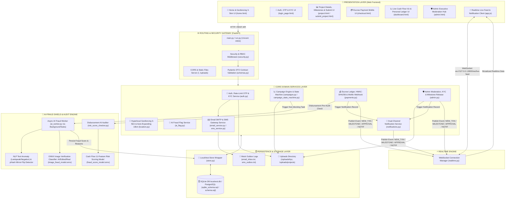

# LocalVest — Nền Tảng Gọi Vốn Cộng Đồng Minh Bạch

> **LocalVest** là nền tảng gọi vốn cộng đồng thế hệ mới, tái định nghĩa sự minh bạch tài chính bằng việc kết hợp cơ chế Ký quỹ dòng tiền theo mốc, trong đó tiền đóng góp của nhà đầu tư không được chuyển giao toàn bộ cho chủ dự án ngay từ đầu, mà được tạm giữ trong một tài khoản ký quỹ trung gian . Tiền sẽ chỉ được giải ngân từng phần khi chủ dự án hoàn thành từng mốc tiến độ thực tế đã cam kết và trình đủ minh chứng nghiệm thu. Nền tảng tích hợp hệ thống xác thực qua 4 lớp ( NLP - Nhận diện từ khóa gian lận qua dự án --> pHash - Nhận diện ảnh bị sử dụng lại so với dự án đã đăng trước trong databse --> Image Fraud Detection - Nhận diện ảnh selfie và KYC giả mạo --> Risk Detection - Nhận diện rủi ro gian lận thông qua hành vi tài chính của chủ dự án)

# TỔNG QUAN KIẾN TRÚC HỆ THỐNG

Hệ thống **LocalVest** được thiết kế theo kiến trúc **Modular Monolith Enterprise**, kết hợp giữa giao diện Web đa trang phản hồi nhanh, hệ thống FASTAPI chuẩn hóa, cơ chế đẩy dữ liệu thời gian thực và bộ máy trí tuệ nhân tạo kiểm tra gian lận bất đồng bộ.

# Sơ Đồ Tổng Quan Kiến Trúc



---

# Chi Tiết Các Phân Lớp Kiến Trúc (Architecture Layers)

1. **Presentation Layer (Web Frontend Application)**:
   - Được xây dựng bằng HTML, CSS và JavaScript thuần (Fetch API, Async/Await).
   - Tích hợp Geolocation API & Bảng điều khiển bản đồ tương tác để lọc dự án trong bán kính 10km.
   - Kết nối WebSocket Client để nhận tin nhắn biến động dòng tiền và tiến độ giải ngân theo thời gian thực.
2. **Routing & Security Gateway Layer (FastAPI Entry Point)**:
   - `run.py` & `backend/main.py`: Điểm khởi chạy hệ thống, mount các thư mục tĩnh Frontend & Uploads.
   - **CORS & Static Middleware**: Phục vụ tài nguyên và cho phép gọi API an toàn.
   - **Security Middleware** (`core/security.py`): Mã hóa mật khẩu chuẩn , phát hành và xác thực JSON Web Token, kiểm soát phân quyền dựa trên vai trò (Investor/Creator/Admin).
   - **Pydantic DTO Layer** (`schemas/schemas.py`): Kiểm tra và validate chặt chẽ kiểu dữ liệu đầu vào/đầu ra của 100% API endpoints.

3. **Core Domain Services Layer (Nghiệp Vụ Cốt Lõi)**:
   - **Auth & KYC Service** (`auth.py`): Quản lý đăng ký, đăng nhập và tải/thẩm định hồ sơ KYC (CCCD, selfie).
   - **Campaign Lifecycle Service** (`campaigns.py` & `campaign_state_machine.py`): Quản lý vòng đời dự án qua State Machine nghiêm ngặt (`draft` ➔ `pending_review` ➔ `active` ➔ `funded` / `expired` ➔ `completed`).
   - **Escrow & Ledger Service** (`payments.py`): Tiếp nhận Webhook thanh toán (MoMo/VNPay) - chỉ đang ở trạng thái demo, duy trì Sổ cái ký quỹ giúp tiền được lưu trữ trên sổ cái tập trung, đảm bảo tính minh bạch dòng tiền.
   - **Geofencing & Spatial Service** (`location.py`): Tính toán khoảng cách địa lý giữa Nhà đầu tư và Dự án bằng thuật toán Haversine / Bounding Box spatial index trong bán kính 10km ( Hiện tại dự án chưa có người sử dụng nên chỉ có thể demo mock data của một số dự án về môi trường/giáo dục).
   - **Admin Moderation Service** (`admin.py`): Bảng điều khiển dành riêng cho Quản trị viên duyệt dự án, thẩm định minh chứng cột mốc và ra lệnh giải ngân cho từng phần.
   - **Notification Service** (`notifications.py`, `sms_service.py`, `email_service.py`): Hệ thống gửi thông báo trong ứng dụng, SMS OTP và Email mô phỏng.

4. **Realtime Communication Engine**:
   - `services/realtime.py`: WebSocket Connection Manager duy trì kết nối `ws://127.0.0.1:8000/ws/live-feed`, tự động hiển thị sự kiện đóng góp vốn và cập nhật mốc giải ngân ngay lập tức tới tất cả người dùng đang truy cập.

5. **AI-Fraud Shield & Audit Engine**:
   - `services/ai_worker.py`: Tiến trình AI chạy ngầm phân tích rủi ro gian lận bất đồng bộ; kết hợp NLP chuẩn hóa tiếng Việt chống lách từ khóa, Perceptual Hashing (pHash) quét ảnh lật/trùng CSDL, và mô hình ONNX Deep Learning phân loại ảnh KYC/dự án theo 3 phân loại (AI-generated, Photoshop, Real).
   - `services/fraud_score_model.onnx` & `image_fraud_model.onnx`: Mô hình AI đã được biên dịch sang định dạng ONNX tối ưu hiệu năng suy luận.
   - `services/risk_score_checker.py`: Kiểm tra độ an toàn trước khi tiền từ ví Ký quỹ (Escrow) được chuyển cho chủ dự án.

6. **Persistence & Data Storage Layer**:
   - `app/store.py`: Kiến trúc Hybrid Store thread-safe kết hợp bộ nhớ RAM siêu tốc và đồng bộ xuống cơ sở dữ liệu.
   - `database/schema.sql` & `sqlite_schema.sql`: Hệ quản trị CSDL PostgreSQL kết hợp mở rộng PostGIS cho truy vấn không gian địa lý ( Phát triển sau này) và SQLite cho môi trường phát triển MVP.
   - `/uploads`: Thư mục lưu trữ tệp tin đính kèm (Ảnh KYC và Ảnh minh chứng giải ngân dự án).
---

# CẤU TRÚC THƯ MỤC

```text
LocalVest/
├── run.py                          # Đây là nơi khởi tạo các luồng dự án tự động 
├── README.md                       # Tài liệu tổng quan kiến trúc hệ thống & hướng dẫn vận hành
├── backend.md                      # Ghi chú chi tiết API Router & danh sách Endpoint
├── requirements.txt                # Khai báo dependencies chính của dự án
│
├── backend/                       
│   ├── main.py                     # Application Entry Point
│   ├── start_server.py             # Script chạy server Backend độc lập
│   ├── test_submit.py              # Script test submit chiến dịch mẫu
│   ├── test_submit2.py             # Script test submit chiến dịch mẫu bổ sung
│   ├── app/                        # Lõi xử lý nghiệp vụ Backend
│   │   ├── config.py               # Cấu hình biến môi trường, JWT & Secret Keys
│   │   ├── store.py                # Hybrid Data Store (Thread-safe In-Memory & Database Sync)
│   │   ├── api/                    # Modular API Routers (8 Dịch vụ RESTful)
│   │   │   ├── admin.py            #   ├── 1. Admin Moderation & Milestone Release API
│   │   │   ├── ai_flag.py          #   ├── 2. AI Risk Score & Flagging Tra cứu API
│   │   │   ├── auth.py             #   ├── 3. Authenticate, RBAC & KYC Upload API
│   │   │   ├── campaigns.py        #   ├── 4. Campaign Management & State Transition API
│   │   │   ├── location.py         #   ├── 5. Geofencing 3-5km Spatial Radius API
│   │   │   ├── notifications.py    #   ├── 6. In-App Notification Center API
│   │   │   ├── payments.py         #   ├── 7. MoMo Payment Webhook & Escrow Ledger API
│   │   │   └── test_routes.py      #   └── 8. Helper Test Routes & Seed Data Generation
│   │   ├── core/                   # Các module bảo mật & quản lý trạng thái cốt lõi
│   │   │   ├── campaign_state_machine.py # State Machine kiểm soát vòng đời chiến dịch
│   │   │   └── security.py         # Mã hóa Password (Bcrypt) & Xử lý JWT Token
│   │   ├── database/               # Cấu hình & Schema Cơ sở dữ liệu
│   │   │   ├── db.py               # Database Connection Manager
│   │   │   ├── localvest.db        # SQLite Database (Storage cục bộ)
│   │   │   ├── schema.sql          # PostgreSQL DDL + PostGIS Spatial Extension
│   │   │   └── sqlite_schema.sql   # SQLite DDL Schema cho môi trường Dev/MVP
│   │   ├── schemas/                # Pydantic Data Transfer Objects (DTO Contracts)
│   │   │   └── schemas.py          # Pydantic Schemas validate dữ liệu Đầu vào / Đầu ra
│   │   ├── services/               # Dịch vụ AI, Realtime & Service Layer
│   │   │   ├── ai_worker.py        # Background Worker tính toán điểm rủi ro gian lận
│   │   │   ├── build_onnx_model.py # Script biên dịch & sinh mô hình ONNX Fraud Check
│   │   │   ├── disbursement_auditor.py # AI Thẩm định bằng chứng nghiệm thu giải ngân
│   │   │   ├── email_service.py    # Mock Email Notification Service
│   │   │   ├── fraud_score_model.onnx # Mô hình AI ONNX dự đoán rủi ro tài chính/chiến dịch
│   │   │   ├── image_fraud_model.onnx # Mô hình AI ONNX phân tích gian lận hình ảnh nghiệm thu
│   │   │   ├── mock_fraud_checker.py # Thuật toán Heuristic Fallback kiểm tra gian lận
│   │   │   ├── notifications.py    # Service quản lý thông báo người dùng
│   │   │   ├── realtime.py         # WebSocket Connection Manager (Live Feed Broadcast)
│   │   │   └── sms_service.py      # Mock SMS OTP & Notification Service
│   │   └── scratch/                # Log / Hộp thư mô phỏng SMS & Email
│   │       ├── email_inbox.txt     # Nhật ký lưu Email gửi đi
│   │       └── sms_outbox.txt      # Nhật ký lưu SMS OTP gửi đi
│   └── uploads/                    # Kho lưu trữ tập tin tải lên
│       ├── kyc/                    # Lưu trữ ảnh CCCD / Giấy tờ định danh KYC
│       └── projects/               # Lưu trữ ảnh đại diện & Bằng chứng nghiệm thu dự án
│
├── frontend/                       # WEB FRONTEND APPLICATION (Vanilla JS, HTML5, CSS3)
│   ├── index.html                  # Trang chủ / Điều hướng chính ứng dụng
│   ├── login_page.html             # Trang Đăng nhập, Đăng ký & Tải hồ sơ KYC
│   ├── home.html                   # Trang Khám phá dự án quanh tôi (Bản đồ & Lọc bán kính)
│   ├── project.html                # Chi tiết dự án, Tiến độ gọi vốn & Minh chứng giải ngân
│   ├── submit_project.html         # Trang Đăng dự án mới & Tạo mốc giải ngân
│   ├── checkout.html               # Trang Đóng góp ký quỹ Escrow (Mô phỏng MoMo/VNPay)
│   ├── dashboard.html              # Bảng điều khiển dòng tiền & Sổ cái minh bạch cá nhân
│   ├── admin.html                  # Bảng điều khiển Quản trị viên (Duyệt KYC & Phê duyệt giải ngân)
│   ├── css/                        # Thư mục chứa tài liệu định dạng giao diện
│   │   └── style.css               # Main Stylesheet ứng dụng
│   └── js/                         # Thư mục script xử lý phía Client
│       ├── app.js                  # Lõi JS: API Fetching, WebSocket Client & LocalStorage Session
│       └── vietnam_address.js      # Dữ liệu & helper xử lý Địa giới hành chính Việt Nam
│
├── docs/                           # TÀI LIỆU KỸ THUẬT & KỊCH BẢN KIỂM THỬ
│   └── test_scenarios/             # Bộ kịch bản kiểm thử chi tiết 5 Module
│       ├── 01_auth_kyc_tests.md           # Kịch bản test Auth & KYC
│       ├── 02_escrow_ledger_tests.md       # Kịch bản test Sổ cái Escrow & Payment
│       ├── 03_ai_fraud_shield_tests.md    # Kịch bản test AI Anti-Fraud
│       ├── 04_geofencing_location_tests.md# Kịch bản test Geofencing 3-5km
│       ├── 05_realtime_websocket_tests.md # Kịch bản test WebSocket Realtime Feed
│       ├── COMPLETE_PRODUCT.md            # Tài liệu hoàn thiện sản phẩm
│       └── DB_GUIDE.md                    # Hướng dẫn cấu hình & vận hành Database
│
└── workflow/                       # 📐 SƠ ĐỒ LUỒNG NGIỆP VỤ (WORKFLOW DIAGRAMS)
    └── WorkFlowDiagram.drawio.html # Sơ đồ luồng hoạt động giao diện trực quan (Draw.io)
```

---

# HƯỚNG DẪN KHỞI CHẠY HỆ THỐNG
```command prompt
clone https://github.com/cav11082007-commits/LocalVest_FinSavage-.git
cd LocalVest
code . 
python run.py
```
```text ADMIN ACCOUNT
Đây là tài khoản quản trị của admin để thử nghiệm hệ thống AI nhận diện rủi ro và các dịch vụ backend khác:

Email: admin@gmail.com / admin@localvest.vn
Password: Admin123@gmail.com
```
---

# HƯỚNG PHÁT TRIỂN VỀ AI SAU NÀY CỦA NHÓM

Để tiếp tục hoàn thiện và đưa LocalVest lên một tầm cao mới sau phiên bản MVP này, dưới đây là các gợi ý phát triển sâu hơn về AI mà nhóm chúng em sẽ thực hiện:

1. **AI Knowledge Graph (GraphDB Fraud Detection)**:
   - Thay vì chỉ check trùng lặp ảnh, chúng ta có thể xây dựng sự liên kết Số điện thoại - IP - CCCD - STK Ngân hàng. AI sẽ phát hiện ra các đường dây tạo chiến dịch ảo và chặn hàng loạt thay vì chặn đơn lẻ.
2. **Generative AI Project Assistant**:
   - Tích hợp mô hình ngôn ngữ lớn (LLM) vào form tạo dự án. Chủ dự án chỉ cần gõ vài dòng ngắn gọn, AI sẽ tự động sinh ra một bản kế hoạch huy động vốn chi tiết, chuyên nghiệp, hấp dẫn người đọc và làm giảm thời gian tạo dự án của chủ dự án.
3. **Hyper-Personalized Recommendation**:
   - Sử dụng Collaborative Filtering AI (tương tự thuật toán của Tiktok) kết hợp với PostGIS Geofencing để gợi ý các dự án phù hợp nhất với sở thích đóng góp và lịch sử tương tác của từng user.
4. **Computer Vision - AI Audit Milestone**:
   - Nâng cấp tính năng giải ngân tự động: Khi chủ dự án upload ảnh nghiệm thu (vd: ảnh phòng học đã lắp xong bàn ghế), AI Object Detection sẽ đếm số lượng bàn ghế trong ảnh xem có khớp với cam kết trong Milestone hay không trước khi báo cáo Admin duyệt.


