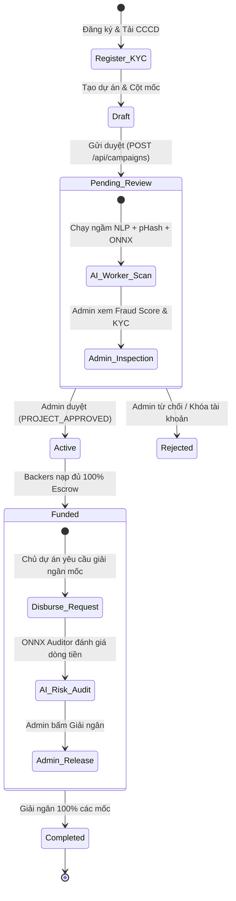

# 🧪 Test Scenario 07: End-to-End (E2E) Campaign Lifecycle & State Machine

## Overview
Kịch bản kiểm thử tích hợp toàn trình (End-to-End Integration Flow) từ lúc khởi tạo tài khoản, nộp hồ sơ KYC, tạo chiến dịch, quét AI Fraud Shield, duyệt Admin, quyên góp Escrow, đạt mục tiêu tài chính, kiểm toán AI Pre-Audit và giải ngân cột mốc.

---

## E2E Step-by-Step Test Walkthrough

### 📍 Giai đoạn 1: Khởi tạo Người dùng & Thẩm định KYC
1. **Đăng ký tài khoản**:
   - `POST /api/auth/register` với Email `owner.eco@gmail.com`, Mật khẩu `OwnerPass@2026`, SĐT `0987654321`.
   - Nhận Access Token JWT.
2. **Nộp hồ sơ định danh KYC**:
   - `POST /api/auth/kyc-upload` gửi ảnh CCCD 2 mặt, STK ngân hàng và liên kết mạng xã hội.
3. **Admin duyệt hồ sơ KYC**:
   - Admin đăng nhập `admin@gmail.com`, gọi `POST /api/admin/kyc/{kyc_id}/status` duyệt `approved`.
   - User được cấp huy hiệu Định danh chính chủ.

---

### 📍 Giai đoạn 2: Tạo Chiến Dịch & Lá Chắn AI Phân Tích Ngầm
1. **Tạo chiến dịch mới**:
   - `POST /api/campaigns` tạo dự án *"Vườn rau hữu cơ trường mầm non xã đảo"* (Mục tiêu: `20.000.000đ`, 2 cột mốc: Mốc 1 `12.000.000đ`, Mốc 2 `8.000.000đ`).
   - Kèm tọa độ: Lat `10.7769`, Lng `106.7009`.
2. **AI Background Worker kích hoạt**:
   - Quét NLP nội dung ➔ Không có từ khóa rủi ro (`score = 0`).
   - Quét pHash ảnh ➔ Không trùng lặp cơ sở dữ liệu.
   - Quét ONNX Deep Learning ➔ Ảnh thật (`real`).
   - Lưu AI Flag với `fraud_score = 0%`, `is_suspicious = False`.

---

### 📍 Giai đoạn 3: Phê Duyệt Quản Trị & Phát Sóng Realtime
1. **Admin duyệt dự án**:
   - Admin mở `admin.html`, thấy điểm rủi ro `0%`, bấm **Duyệt dự án**.
   - `POST /api/admin/approve-project` đổi trạng thái từ `pending_review` ➔ `active`.
2. **WebSocket Broadcast**:
   - Toàn hệ thống nhận sự kiện `PROJECT_APPROVED`. Dự án lập tức xuất hiện trên trang chủ `home.html` của tất cả Backers.

---

### 📍 Giai đoạn 4: Tìm Kiếm Geofencing & Đóng Góp Ký Quỹ Escrow
1. **Backer tìm kiếm theo bán kính**:
   - `GET /api/location/nearby?lat=10.7769&lng=106.7009&radius_km=3.0` trả về dự án ở khoảng cách `0.0 km`.
2. **Quyên góp tiền qua MoMo**:
   - Backer A nạp `12.000.000đ` ➔ Sổ cái ghi nhận, WebSocket phát `NEW_TRANSACTION`.
   - Backer B nạp `8.000.000đ` ➔ Tổng quỹ đạt `20.000.000đ` (100% mục tiêu).
   - Dự án tự động chuyển trạng thái `funded`. Hệ thống tự động chặn các lượt nạp tiền phát sinh tiếp theo.

---

### 📍 Giai đoạn 5: Kiểm Toán AI Dòng Tiền & Giải Ngân Cột Mốc
1. **Giải ngân Mốc 1 (`12.000.000đ`)**:
   - Admin bấm Phê duyệt Giải ngân Mốc 1.
   - Mô hình ONNX `fraud_score_model.onnx` kiểm tra 11 chỉ số dòng tiền ➔ Đạt chuẩn an toàn `SAFE`.
   - `POST /api/admin/release-milestone` ghi bút toán `-12.000.000đ` vào Sổ cái.
   - WebSocket phát `MILESTONE_RELEASED`.
2. **Giải ngân Mốc 2 (`8.000.000đ`)**:
   - Admin duyệt giải ngân nốt mốc cuối cùng.
   - Quỹ Escrow giải ngân 100%, dự án hoàn thành xuất sắc (`completed`).
